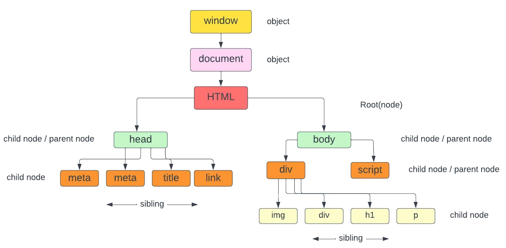

# Document Object Model (DOM) 🌐

The Document Object Model (DOM) serves as an interface, presenting HTML and XML documents as a tree structure. Each node in this tree represents a part of the document. JavaScript can use the DOM to dynamically access and update the content, structure, and style of web pages. When a web page loads, the browser parses the HTML and constructs the DOM, making it available for manipulation through JavaScript. 


### Key aspects of the DOM: 🔑
Tree Structure:
The DOM represents the document as a hierarchical tree, with elements, attributes, and text forming nodes.


### Node Types: 📊
Different types of nodes exist, including document nodes, element nodes (tags), text nodes (content within tags), and attribute nodes.



### Accessing Elements: 🔍
JavaScript provides methods to select elements within the DOM, such as 

#### 1. getElementById() :-  
Is a method used to retrieve an HTML element from the DOM (Document Object Model) by its unique ID. It takes a single argument, which is the ID of the element we want to select. Once the element is selected, we can perform various operations such as updating its content, modifying its style, or attaching event listeners to it.
```html
<!DOCTYPE html>
<html lang="en">
<head>
    <meta charset="UTF-8">
    <meta name="viewport" content="width=device-width, initial-scale=1.0">
    <title>Day-05 </title>
</head>
<body>
    <h1 id="heading">DOM</h1>
    <div class="box"></div>
    <p>Mohammed</p>
    <p> Arif</p>
    <p> ulla</p>


<script>
        let headingElement = document.getElementById('heading');
        console.log(headingElement);

        headingElement.style.backgroundColor = 'red';
</script>

</body>
</html>

```

#### 2. getElementsByClassName() :- 🏷️

The method getElementsByClassName() returns a collection of elements with the specified class name. The collection is in the form of array-like object of all the child elements which matches the given class name/names.

It accepts a single argument, which is the class name to be matched.

```html
<!DOCTYPE html>
<html lang="en">
<head>
    <meta charset="UTF-8">
    <meta name="viewport" content="width=device-width, initial-scale=1.0">
    <title>Day-05 </title>
</head>
<body>
    <h1 id="heading">DOM</h1>
    <div class="box"></div>
    <p>Mohammed</p>
    <p> Arif</p>
    <p> ulla</p>

    
<script>
        let boxElement = document.getElementsByClassName('box');
        console.log(boxElement); // returns an array

        boxElement[0].style.backgroundColor = 'blue';
        boxElement[0].style.height = '200px';
        boxElement[0].style.width = '200px';
</script>

</body>
</html>

```

#### 3. getElementsByTagName() :- 🏷️

getElementsByTagName() is a powerful method in JavaScript used to fetch HTML elements from the DOM (Document Object Model) based on their tag names. It accepts a single argument, which is the tag name of the elements to be selected.

```html
<!DOCTYPE html>
<html lang="en">
<head>
    <meta charset="UTF-8">
    <meta name="viewport" content="width=device-width, initial-scale=1.0">
    <title>Day-05 </title>
</head>
<body>
    <h1 id="heading">DOM</h1>
    <div class="box"></div>
    <p>Mohammed</p>
    <p> Arif</p>
    <p> ulla</p>

    
<script>
        let nameElement = document.getElementsByTagName('p');
        console.log(nameElement); // returns an array

        nameElement[0].style.backgroundColor = 'lightseagreen';
        nameElement[0].style.color = 'white';

        nameElement[1].style.backgroundColor = 'hotpink';
        nameElement[1].style.color = 'black';

        nameElement[2].style.backgroundColor = 'green';
        nameElement[2].style.color = 'white';
</script>
</body>
</html>

```

### Query Selectors 🔎

Query selectors are methods in JavaScript that allow us to select HTML elements based on various criteria, such as tag name, class, ID, attribute, or even complex CSS selectors. They are part of the Document Object Model (DOM) API and provide a concise and efficient way to interact with HTML elements from JavaScript code.

There are two different Query Selectors:

#### 1. querySelector() 🎯

Returns the first element within the document that matches the specified selector or group of selectors.
If no matches are found, it returns null.

```html
<!DOCTYPE html>
<html lang="en">
<head>
    <meta charset="UTF-8">
    <meta name="viewport" content="width=device-width, initial-scale=1.0">
    <title>Day-05 </title>
</head>
<body>
    <div id="topic">Learning DOM-1</div>
    <div class="topic">Learning DOM-2</div>
    <div class="topic">Learning DOM-3</div>
    <div class="topic">Learning DOM-4</div>
    <h1 class="topic">Learning DOM-5</h1>


    <script>
        let element = document.querySelector(".topic");
      
        element.style.backgroundColor = "yellow"; // it is changed to first one only
    </script>

</body>
</html>
```

#### 2. querySelectorAll() 🎯🎯

It returns a static NodeList representing a list of elements that match the specified group of selectors.
If no matches are found, it returns an empty NodeList.
```html
<!DOCTYPE html>
<html lang="en">
<head>
    <meta charset="UTF-8">
    <meta name="viewport" content="width=device-width, initial-scale=1.0">
    <title>Day-05 </title>
</head>
<body>
    <div id="topic">Learning DOM-1</div>
    <div class="topic">Learning DOM-2</div>
    <div class="topic">Learning DOM-3</div>
    <div class="topic">Learning DOM-4</div>
    <h1 class="topic">Learning DOM-5</h1>


    <script>
        let elementOne = document.querySelectorAll("div");
        console.log(elementOne); // returns array


        elementOne[3].style.backgroundColor = "lightseagreen";
    </script>

</body>
</html>
```

#### Points to remember: ✅
* The basic syntax for query selectors involves using the document object followed by the querySelector() or querySelectorAll() method.

* Use querySelector() for selecting a single element and querySelectorAll() for selecting multiple elements.

* Be specific with selectors to target elements efficiently and avoid unintended selections.

### Modifying HTML DOM elements 🛠️

#### 1. innerHTML 📝

The innerHTML property allows us to retrieve or replace the HTML content within an element. It represents the markup of the element's descendants, including text and child elements.

```html
<!DOCTYPE html>
<html lang="en">
<head>
    <meta charset="UTF-8">
    <meta name="viewport" content="width=device-width, initial-scale=1.0">
    <title>Modifying html dom elements</title>
</head>
<body>
    
    <div id="container">
        <p>Hello</p>
        <span>JS</span>
        <p style="display: none;">!</p>
    </div>

    <script>
        let container = document.getElementById("container"); 

        let content = container.innerHTML;
        console.log(content);

        let changeContent = "Element changed";
        container.innerHTML = changeContent;
    </script>

</body>
</html>
```

#### 2. innerText 📄
The innerText property retrieves or sets the text content of the specified element, excluding any HTML tags. It represents only the visible text within the element, without considering its child elements.

* innerText prints text as it appears on screen.

* innerText ignores the content with property hidden

* Examples is the best way to understand so let's go.

```html
<!DOCTYPE html>
<html lang="en">
<head>
    <meta charset="UTF-8">
    <meta name="viewport" content="width=device-width, initial-scale=1.0">
    <title>Modifying html dom elements</title>
</head>
<body>
    
    <div id="container">
        <p>Hello</p>
        <span>JS</span>
        <p style="display: none;">!</p>
    </div>

    <script>
        let container = document.getElementById("container");

        let example = container.innerText;
        console.log(example);

        let newText = "Hello what's up guys";
        container.innerText = newText;
    </script>
</body>
</html>
```

#### 3. outerHTML 📦
The outerHTML property, on the other hand, represents the HTML content of the element itself along with its descendants. It includes the element's start tag, content, and end tag.

```html
<!DOCTYPE html>
<html lang="en">
<head>
    <meta charset="UTF-8">
    <meta name="viewport" content="width=device-width, initial-scale=1.0">
    <title>Modifying html dom elements</title>
</head>
<body>
    
    <div id="container">
        <p>Hello</p>
        <span>JS</span>
        <p style="display: none;">!</p>
    </div>

    <script>
        let container = document.getElementById("container");
        let newContainer = container.outerHTML;
        console.log(newContainer);

        let newElement = "<h1>Arif here...!!!</h1>";
        container.outerHTML = newElement;
    </script>
</body>
</html>
```

#### 4. textContent 📃
The textContent property retrieves or sets the text content of the specified element, but unlike innerText, it includes all text content, including child elements and their text.

The textContent property returns the content as it is in the HTML markup.

Like innerText, it also ignores the HTML tags. But it doesn't consider styles, so it returns the text even though it's hidden.

```html
<!DOCTYPE html>
<html lang="en">
<head>
    <meta charset="UTF-8">
    <meta name="viewport" content="width=device-width, initial-scale=1.0">
    <title>Modifying html dom elements</title>
</head>
<body>
    
    <div id="container">
        <p>Hello</p>
        <span>JS</span>
        <p style="display: none;">!</p>
    </div>

    <script>
        let container = document.getElementById("container");
        let newContainer = container.textContent;
        console.log(newContainer);

        let newText = "Hiiiiiii";
        container.textContent = newText;
    </script>
</body>
</html>
```

innerHTML vs. outerHTML: innerHTML deals with the content inside the element, while outerHTML includes the element itself.

innerText vs. textContent: innerText retrieves only visible text, excluding child elements, while textContent retrieves all text content, including child elements.

#### Conclusion ✨
* Use innerHTML and outerHTML when you need to manipulate HTML content directly.

* Prefer textContent when dealing with text-only content to avoid unintentional HTML injection.

* Be cautious with innerText as it may not behave consistently across browsers, especially in terms of white space handling.

### Creating HTML Element 🏗️

#### 1. createElement() Method 🛠️
The document.createElement() method is a fundamental DOM manipulation technique in JavaScript. As the name suggests, it allows us to dynamically create HTML elements within the DOM. The method takes a single argument.

The single argument should be the tag name of the element to be created, and it returns a reference to the newly created element.

```html
<!DOCTYPE html>
<html lang="en">
<head>
    <meta charset="UTF-8">
    <meta name="viewport" content="width=device-width, initial-scale=1.0">
    <title>Modifying html dom elements</title>
</head>
<body>
    
 
    <script>
        let elementOne = document.createElement("div");
        console.log(elementOne);

        let elementTwo = document.createElement("h1");
        console.log(elementTwo);
    </script>
</body>
</html>
```

#### 2. appendChild() 👶
The appendChild() method belongs to the Node interface and is primarily used to add a node to the end of the list of children of a specified parent node.

Example 01:-
```javascript
let heading = document.createElement("h2");
heading.textContent = "Hello...!";

document.body.appendChild(para);
```

Example 02:-

```html
<!DOCTYPE html>
<html lang="en">
<head>
    <meta charset="UTF-8">
    <meta name="viewport" content="width=device-width, initial-scale=1.0">
    <title>Modifying html dom elements</title>
</head>
<body>
    <div id="box">
        <h1>H1</h1>
        <h2>H2</h2>
        <h3>H3</h3>
        <h4>H4</h4>
    </div>

    <script>
        let parent = document.getElementById("box");
        let para = document.createElement("p");
        para.textContent = "Paragraph";

        parent.appendChild(para);
    </script>
</body>
</html>
```

### Methods of changing CSS properties in JavaScript 🎨

#### 1. The 'style' Method 💅
The style method allows us to directly access and modify CSS properties of an HTML element through its style object.

The basic syntax involves accessing an element and then setting or getting its style properties.

```html
<!DOCTYPE html>
<html lang="en">
<head>
    <meta charset="UTF-8">
    <meta name="viewport" content="width=device-width, initial-scale=1.0">
    <title>Modifying html dom elements</title>
</head>
<body>
    <div id="box">
        <h1>H1</h1>
        <h2>H2</h2>
        <h3>H3</h3>
        <h4>H4</h4>
    </div>

    <script>
        let box = document.getElementById("box");
        box.style.backgroundColor = "lightseagreen";
        box.style.color = "white";
    </script>
</body>
</html>
```

#### 2. The 'cssText' Method 📝
The cssText is similar to the style method but the only difference is, using cssText we can handle multiple CSS properties in single string. The basic syntax involves accessing an element's style property and setting or getting its cssText property.

```html
<!DOCTYPE html>
<html lang="en">
<head>
    <meta charset="UTF-8">
    <meta name="viewport" content="width=device-width, initial-scale=1.0">
    <title>Modifying html dom elements</title>
</head>
<body>
    <div id="box">
        <h1>H1</h1>
        <h2>H2</h2>
        <h3>H3</h3>
        <h4>H4</h4>
    </div>

    <script>
       let elementTwo = document.querySelector("h2");
        elementTwo.style.cssText = 'color: white; font-size: 5rem; background-color: lightseagreen';
    </script>
</body>
</html>
```

### HTML DOM setAttribute() 🔧

#### 1. setAttribute() ✏️
The setAttribute() method in JavaScript is used to add a new attribute or update an existing attribute on an HTML element. This method allows us to dynamically modify the attributes of HTML elements in our web page.
```html
<!DOCTYPE html>
<html lang="en">
<head>
    <meta charset="UTF-8">
    <meta name="viewport" content="width=device-width, initial-scale=1.0">
    <title>SetAttribute</title>
</head>
<body>
    
    <div>
        <h1>Arif...!</h1>
    </div>

    <script>
        let container = document.querySelector("div");
        container.setAttribute("class","box");
        console.log(container);
        container.setAttribute("style","background-color:red;");
    </script>
</body>
</html>
```

#### 2. getAttribute() 🔍

The getAttribute() method in JavaScript is used to retrieve the value of a specified attribute on an HTML element. This method allows us to access the value of any attribute associated with an HTML element.

```html
<!DOCTYPE html>
<html lang="en">
<head>
    <meta charset="UTF-8">
    <meta name="viewport" content="width=device-width, initial-scale=1.0">
    <title>SetAttribute</title>
</head>
<body>
    
    <div id="box">
        <h1>Arif...!</h1>
    </div>


    <script>
        let container = document.querySelector("div");
        let value = container.getAttribute("id");
        console.log(value); // box
    </script>
</body>
</html>
```

### HTML DOM insertAdjacentElement() 📌

The insertAdjacentElement() method allows us to insert a given element into the DOM relative to a specified target element. It provides precise control over where the new element is inserted, offering four different insertion positions:

* beforebegin: Insert the element before the targetElement itself. ⬆️
* afterbegin: Insert the element just inside the targetElement, before its first child. ↘️
* beforeend: Insert the element just inside the targetElement, after its last child. ↙️
* afterend: Insert the element after the targetElement itself. ⬇️

Syntax:
```javascript
targetElement.insertAdjacentElement(position, newElement);
```

```html
<!DOCTYPE html>
<html lang="en">
<head>
    <meta charset="UTF-8">
    <meta name="viewport" content="width=device-width, initial-scale=1.0">
    <title>SetAttribute</title>
</head>
<body>
    
    <div id="box">
        <h1>Arif...!</h1>
    </div>


    <script>
        let newContent = document.createElement("p");
        newContent.textContent = "Hello this is";

        let oldContent = document.querySelector("#box");

// beforebegin
        // oldContent.insertAdjacentElement('beforebegin',newContent);

// afterbegin
        // oldContent.insertAdjacentElement('afterbegin',newContent);

// beforeend
        // oldContent.insertAdjacentElement('beforeend',newContent);

// afterend
        // oldContent.insertAdjacentElement('afterend',newContent);
    </script>
</body>
</html>
```
